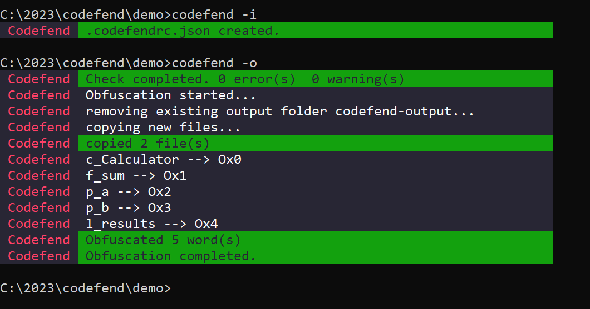

<p align="center">
 
</p>

# Codefend


Codefend short for "Code Defender" is a Code obfuscator CLI that protects your code regardless of the programming language or framework.\
The complete list of examples for different programming languages/frameworks can be viewed [here](#examples)\
`Please make sure to read the `[`Philosophy`](#philosophy)` behind the obfuscation First to understand why Codefend can work with any code written in any language.`

## Installation

#### `Webpack`

If you're using Webpack, it is recommended to use
[webpack-plugin-codefend](https://www.npmjs.com/package/webpack-plugin-codefend) instead of directly using the CLI, you can skip the installation in this case and jump directly to the [plugin documentation](https://github.com/Codefend/webpack-plugin-codefend#readme)

#### `Rollup/Vite`

If you're using Rollup or Vite, it is recommended to use
[rollup-plugin-codefend](https://www.npmjs.com/package/rollup-plugin-codefend)
instead of directly using the CLI, you can skip the installation in this case and jump directly to the [plugin documentation](https://github.com/Codefend/rollup-plugin-codefend#readme)

#### `Globally`

```bash
npm install -g codefend
```

#### `Dev dependency`

```bash
npm install -D codefend
```

#### `npx`

In case you want to execute it directly without installing it on your machine:

```bash
npx codefend -i  //required only the first time, generates .codefendrc.json
npx codefend -o  //obfuscates your whole project inside a new directory: 'codefend-output'
```

## Commands

```shell
Usage: codefend [options]

Defend Your Code By All Means Necessary. 💪 😎

Options:
  -i, --init       Create the config file (.codefendrc.json)
  -o, --obfuscate  Obfuscate the project
  -c, --check      Check the config file for potential warnings/errors
  -v, --version    Output the version number
  -h, --help       Display help for command
```

## Philosophy

1. Codefend first copy all the files of your project to another directory ` by default: /codefend-output`.
2. Parse every word of every file of your project, searching for patterns in your code.
3. Encrypts the detected words (Classes,Functions,Variables...) that matches the pattern.

**The only thing Codefend needs from you as a programmer** is to `follow a specific naming convention for the words that you want to obfuscate` (Classes,Functions,Variables...) `and Codefend will do the rest ✨`\
This basic rule applies to all the languages and the frameworks that you will be programming with while using Codefend to defend your source.

Once your source code is obfuscated you can build the obfuscated version of your code and deploy it

## Basic Usage

### `Step 1`: Naming convention

`Add prefixes to the words that you want to encrypt.`

```js
//as a starting point:  prefix the words that should be encrypted with l_
class l_Calculator {
  l_sum(l_a, l_b) {
    const l_results = l_a + l_b;
    return l_results;
  }
}

//>>>>>>==== Will Become ======<<<<<<

class Ox0 {
  Ox1(Ox2, Ox3) {
    const Ox4 = Ox2 + Ox3;
    return Ox4;
  }
}

// Or for a better organized naming convention:
/** 
 * 
1- class -> starts with c_
2- function -> starts with f_
3- parameter -> starts with p_
4- local variable -> starts with l_
*/
class c_Calculator {
  f_sum(p_a, p_b) {
    const l_results = p_a + p_b;
    return l_results;
  }
}

//>>>>>>==== Same results ======<<<<<<
class Ox0 {
  Ox1(Ox2, Ox3) {
    const Ox4 = Ox2 + Ox3;
    return Ox4;
  }
}
```

```html
<!-- Html example, can work also with Angular,React,Vue,Svelte... in the same way -->

<html>
  <head>
    <style>
      .l_red {
        color: red;
      }
    </style>
  </head>
  <body>
    <div class="l_red">l_secret</div>
    <div class="l_red">Hello World</div>
  </body>
</html>

<!-- Will Become -->

<html>
  <head>
    <style>
      .Ox1 {
        color: red;
      }
    </style>
  </head>
  <body>
    <div class="Ox1">Ox0</div>
    <div class="Ox1">Hello World</div>
  </body>
</html>
```

### `Step 2`: Run the CLI

`navigate to the root of your project and run the following commands:`

```bash
codefend -i  //required only the first time, generates .codefendrc.json

```

```bash
codefend -o  //obfuscates your whole project inside a new directory: 'codefend-output'
```

<p align="center">
 
</p>

### `Step 3`: install dependencies, build and deploy the obfuscated project

```bash

      /* navigate to the output folder*/
      cd codefend-output

      /* install the dependencies of the new obfuscated project */
      npm install

      /* run the obfuscated project */
      ...

      /* build the obfuscated project */
      ...

      /*⚠️⚠️⚠️ in case the run or the build fails, its likely because some reserved words have been obfuscated that should not have been obfuscated.

      Solution:

      1. set debug=true in .codefendrc.json (to display a list of the words that are being obfuscated)
      2. detect what are the words that should not be obfuscated from the list displayed
      3. add the words to the ignoredWords array inside .codefendrc.json
      */


      /* deploy the obfuscated project */
      ...
```

## Examples

1. ### [`Node js`](./examples/nodejs)

2. ### [`Angular`](./examples/angular)

3. ### [`React`](./examples/react)

4. ### [`Vue`](./examples/vue)

5. ### [`Svelte`](./examples/svelte)

6. ### [`Python`](./examples/python)

7. ### [`C#`](./examples/C%23)

8. ### [`C++`](./examples/C%2B%2B)

## Configuration

```js
/* default configuration generated inside .codefendrc.json when executing codefend -i*/

{
  /** debug: boolean
  * Displays additional logs.
  */
  debug: true,


  generationOptions: {


    /** inputDir: string
     * Folder that should be copied and obfuscated by Codefend.
     * Note: it can be kept "." to clone and obfuscate the entire project
    */
    inputDir: ".",


    /** outputDir: string
     * Output folder where Codefend will generate the cloned obfuscated version of the project.
    */
    outputDir: "codefend-output",


    /** outputDir: string []
     * Files/folders that shouldn't be copied by Codefend to the output folder.
    */
    ignoredFilesInGeneration: [
      "codefend-output",
      ".codefendrc.json",
      "node_modules",
      ".git",
      ".github",
      ".gitignore",
      ".vscode",
      "build",
      "dist",
      "README.md"
    ],
  },

  obfuscationOptions: {


    /** prefix: string
    * Prefix of each variable generated by Codefend.
    * Note: the first letter of the prefix must be either an alphabet or "_" so that the variable generated be valid.
    */
    prefix: "Ox",


    /** predefinedWords: Array<{originalWord:string, targetWord:string}>
    * Words that should be obfuscated in a special (determined output)
    * {"originalWord":"l_secretVar" , "targetWord": "123456"}
    * Note: the original word must have a prefix 'l_' or must match the regex to be detected by Codefend in the first place and get replaced.
    */
    predefinedWords: [],


    /** ignoredWords: Array<string>
    * Words that matches the pattern to be obfuscated but should be kept as is without being obfuscated.
    * Useful for words that are being obfuscated and causing errors when running or building the project
    */
    ignoredWords: ["node_modules"],


    /** regexList: Array<{name:string,value:string,flag:string}>
    * Regex for detecting the words to be obfuscated
    *
    * Default regex accept the following words format:
    * l_John node_John node_John_Doe ...
    * => any word having "_" not as first character
    *
    * Note: the regex can be changed, do that on your own risk
    * Note: multiple regexes can be applied together, they will run sequentially, do that on your own risk.
    * more examples on regex coming soon in Codefend v2
    */
    regexList: [
      {
        name: "main",
        value: "([a-zA-Z]+(_[a-zA-Z0-9]+)+)",
        flag: "g",
      }
    ],
  },
}

```

## Contributing

Pull requests are welcome. For major changes, please open an issue first to discuss what you would like to change.

Please make sure to update tests as appropriate.

## License

[MIT](./LICENSE.md)
