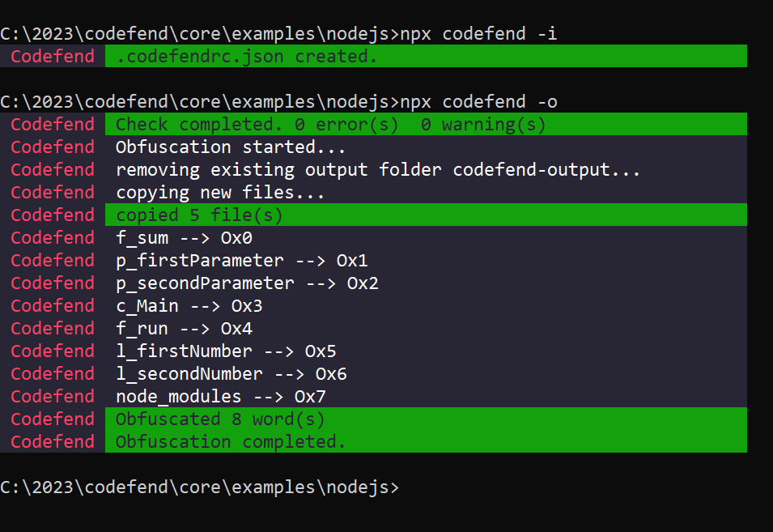

<p align="center">
 
</p>

# Codefend

Codefend short for "Code Defender" encrypts your code regardless of your source code language or framework.

## Installation

#### `Globally`

```bash
npm install -g codefend
```

#### `Dev dependency`

```bash
npm install -D codefend
```

#### `npx`

In case you want to execute it directly without installing it on your machine:

```bash
npx codefend -i  //generates .codefendrc.json
npx codefend -o  //obfuscates your whole project inside a new directory: 'codefend-output'
```

## Commands

```bash
Usage: codefend [options]

Defend Your Code By All Means Necessary. 💪 😎

Options:
  -V, --version    output the version number
  -i, --init       Create .codefendrc.json (configuration file)
  -c, --check      Check .codefendrc.json for potential warnings/errors
  -o, --obfuscate  Obfuscate your project (based on .codefendrc.json)
  -h, --help       display help for command
```

## Philosophy

The only thing Codefend needs from you as a programmer is to follow a specific **naming convention** for the **words** that you want to obfuscate **(variable/functions/classes...)** and Codefend will do the rest for you!
This basic rule applies to all the languages and the frameworks that you will be programming with.

## Configuration

```js
//default configuration generated inside .codefendrc.json
{
  debug: true,    // for additional logs
  generationOptions: {
    inputDir: ".", // the folder that should be copied and obfuscated ( keep it . if you're running in the same directory)
    outputDir: "codefend-output", // the output folder that will be an obfuscated clone of your code
    ignoredFilesInGeneration: [ // the files that should not be copied to the output folder
      "codefend-output",
      ".codefendrc.json",
      "node_modules",
      ".git",
      ".github",
      ".gitignore",
      ".vscode",
      "build",
      "dist",
    ],
  },

  obfuscationOptions: {
    prefix: "Ox", // the prefix of each variable, make sure its a valid character to start with a variable ( e.g dont start with "-"" or a number)
    predefinedWords: [], // words that you want to obfuscate them in a static way
    ignoredWords: ["node_modules"], // words that you dont want to obfuscate them and they unfortunately match the regex :)
    regexList: [
      {
        name: "main",
        value: "([a-zA-Z]+(_[a-zA-Z0-9]+)+)",//regex for variables,functions,classes ...
        flag: "g",
      },
      {
        name: "file",
        value: "((cmp|lib)+(-[a-zA-Z]+)+)",//regex for files (coming soon)
        flag: "g",
      },
    ],
  },
}

```

## Usage

### `Naming convention`

```js
/** 
1- local variable -> starts with l_
2- parameter -> starts with p_
3- function -> starts with f_
4- class -> starts with c_
*/
class c_Calculator {
  f_sum(p_a, p_b) {
    const l_results = p_a + p_b;
    return l_results;
  }
}
```

Note: its possible to not follow the exact naming convention as long as the words you want to encrypts match the regex,

```js
//as an example you can use the same prefix for all words:
class l_Calculator {
  l_sum(l_a, l_b) {
    const l_results = l_a + l_b;
    return l_results;
  }
}
```

```js
// or use a custom prefix
class myApp_Calculator {
  myApp_sum(myApp_a, myApp_b) {
    const myApp_results = myApp_a + myApp_b;
    return myApp_results;
  }
}
```

it is possible also to change the regex from the .codefendrc.json file so that you name the variables in another way

### `CLI`

<p align="center">
 
</p>

## Examples

1. ### [Node js](https://github.com/Codefend/core/tree/main/examples/nodejs)

2. ### `Angular` (coming soon)

3. ### `React` (coming soon)

4. ### `Vue` (coming soon)

5. ### `Svelte` (coming soon)

## Contributing

Pull requests are welcome. For major changes, please open an issue first to discuss what you would like to change.

Please make sure to update tests as appropriate.

## License

[MIT](https://choosealicense.com/licenses/mit/)
