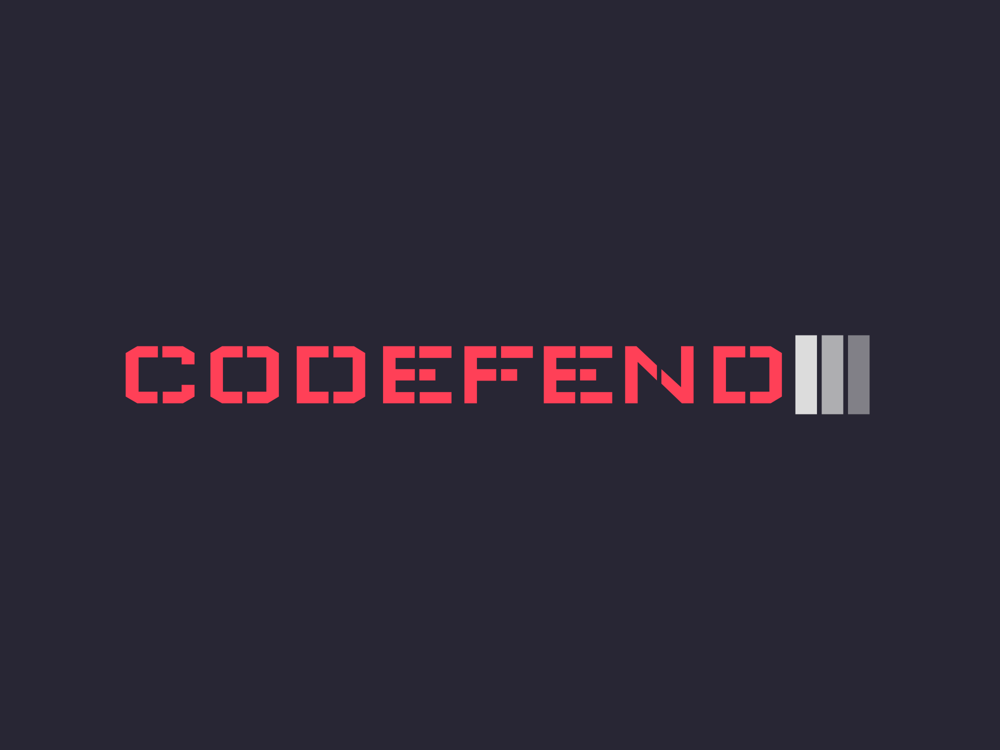

<p align="center">
 
</p>

# Codefend

Codefend short for "Code Defender" encrypts your code regardless of your source code language or framework.

## Installation

```bash
npm install codefend

Usage: codefend [options]

Defend Your Code By All Means Necessary.

Options:
  -V, --version    output the version number
  -i, --init       Create .codefendrc.json (configuration file)
  -c, --check      Check .codefendrc.json for potential warnings/errors
  -o, --obfuscate  Obfuscate your project (based on .codefendrc.json)
  -h, --help       display help for command
```

## Examples

[Node js](https://github.com/Codefend/core/tree/main/examples/nodejs)

### Angular (coming soon)

### React (coming soon)

### Vue (coming soon)

### Svelte (coming soon)

## Contributing

Pull requests are welcome. For major changes, please open an issue first to discuss what you would like to change.

Please make sure to update tests as appropriate.

## License

[MIT](https://choosealicense.com/licenses/mit/)
